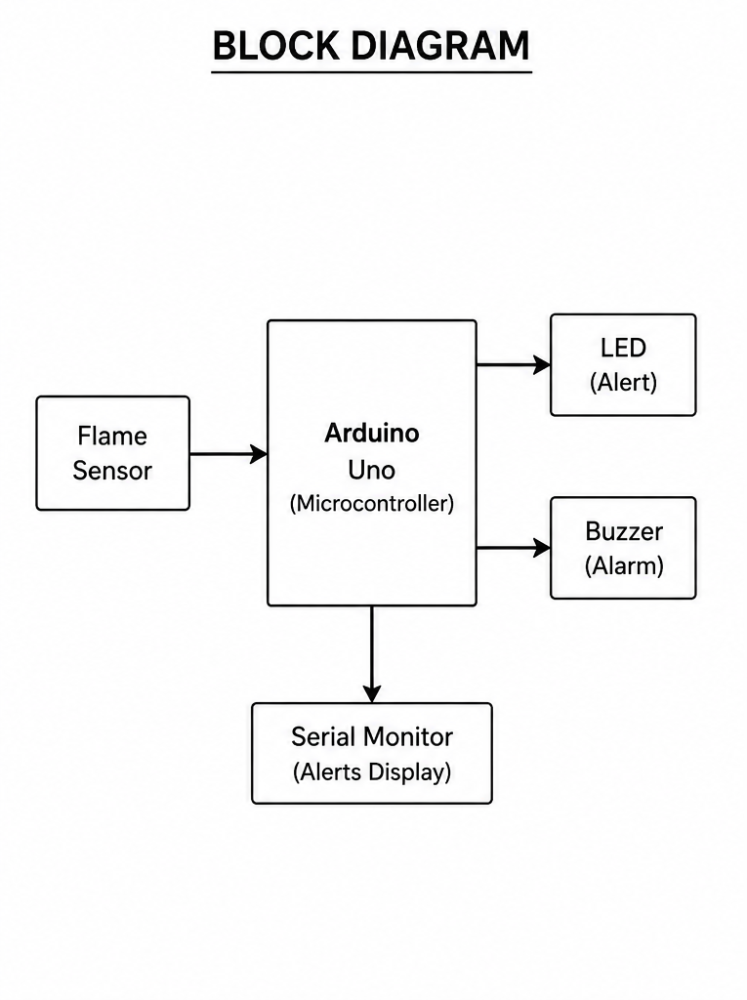
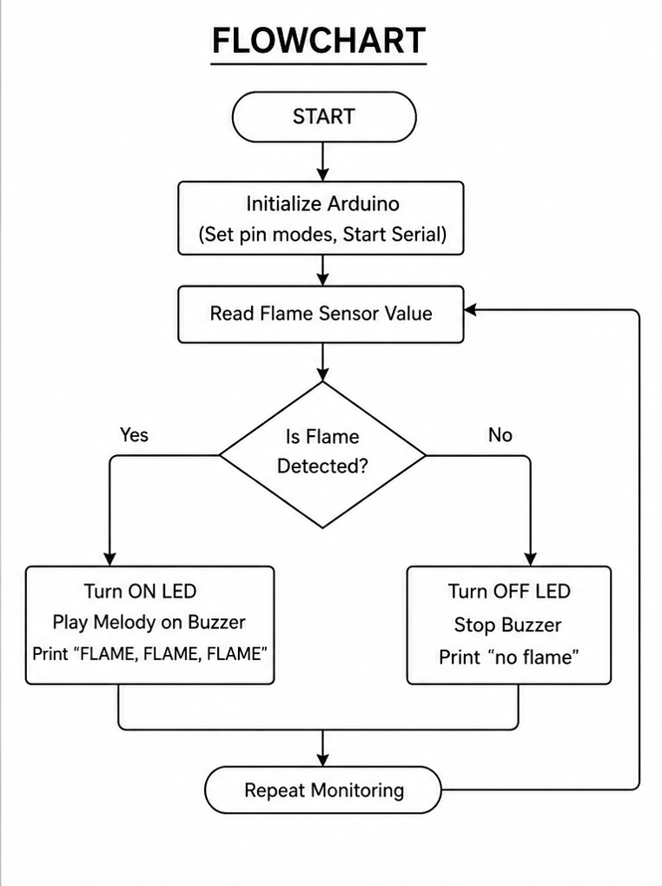

# Automated Fire Detection and Safety Alert System using IOT

## Overview

The **Automated Fire Detection and Safety Alert System** is an Arduino-based embedded system designed to detect the presence of fire using a flame sensor. The system continuously monitors the environment and immediately activates visual and audible alarms whenever a flame is detected.

When the flame sensor detects fire, the Arduino turns on an LED indicator and plays an alarm melody through a buzzer to alert nearby people. If no flame is detected, the LED remains OFF, the buzzer is silent, and the system continues monitoring.

This project demonstrates the fundamentals of sensor interfacing, digital input processing, and real-time fire detection using Arduino.

---

# Objectives

- Detect fire using a flame sensor.
- Provide instant visual and audible alerts.
- Learn digital sensor interfacing with Arduino.
- Understand basic fire safety automation.
- Display system status through the Arduino Serial Monitor.

---

# Features

- Real-time flame detection
- LED warning indicator
- Audible buzzer alarm
- Continuous monitoring
- Serial Monitor status display
- Simple and beginner-friendly implementation
- Low-cost hardware design

---

# Components Required

| Component | Quantity |
|-----------|----------|
| Arduino Uno | 1 |
| Flame Sensor Module | 1 |
| LED | 1 |
| 220Ω Resistor | 1 |
| Active Buzzer | 1 |
| Breadboard | 1 |
| Jumper Wires | As Required |
| USB Cable | 1 |
| Computer/Laptop | 1 |

---

# Software Requirements

- Arduino IDE
- Arduino Uno Board Package
- USB Driver (if required)

---

# Circuit Connections

| Component | Arduino Pin |
|-----------|-------------|
| Flame Sensor OUT | Digital Pin 4 |
| LED (+) | Digital Pin 2 |
| Buzzer (+) | Digital Pin 3 |
| Flame Sensor VCC | 5V |
| Flame Sensor GND | GND |
| LED (-) | GND |
| Buzzer (-) | GND |

---

# Working Principle

1. Arduino initializes all input and output pins.
2. The flame sensor continuously monitors the surrounding area.
3. Arduino reads the digital output from the flame sensor.
4. If a flame is detected:
   - LED turns ON.
   - Buzzer plays an alarm melody.
   - "FLAME, FLAME, FLAME" is displayed on the Serial Monitor.
5. If no flame is detected:
   - LED remains OFF.
   - Buzzer stops.
   - "no flame" is displayed on the Serial Monitor.
6. The monitoring process repeats continuously.

---

# Sample Output

```text
FLAME, FLAME, FLAME
```

```text
no flame
```

---

# Project Structure

```text
Fire-Detection-System/
│
├── README.md
├── Fire_Detection_System.ino
│
└── Images/
    ├── Block_Diagram.png
    └── Flow_Diagram.png
```

---

# Applications

- Fire Detection Systems
- Home Safety
- Office Fire Monitoring
- Industrial Safety
- Laboratory Safety
- Educational Arduino Projects
- Smart Building Automation

---

# Advantages

- Low-cost implementation
- Easy to build
- Fast fire detection
- Immediate visual warning
- Audible alarm notification
- Beginner-friendly project
- Expandable for IoT applications

---

# Limitations

- Detects only nearby flames.
- Cannot detect smoke without a smoke sensor.
- Limited detection range.
- Requires continuous power supply.
- Does not automatically contact emergency services.

---

# Future Enhancements

- GSM SMS Alert
- Wi-Fi IoT Monitoring
- Mobile Application Integration
- Blynk Dashboard
- Email Notifications
- LCD Display
- Relay-controlled Water Sprinkler
- Smoke Sensor Integration
- Temperature Sensor Integration
- Cloud Data Logging

---

# Technologies Used

- Arduino Uno
- Embedded C/C++
- Arduino IDE
- Flame Sensor
- LED Indicator
- Active Buzzer
- Serial Communication

---

# Project Images

# Block Diagram

```markdown

```

---

# Flow Diagram

```markdown

```

---

# Author

**Lalithambigai Kathiresan**

Bachelor of Engineering (Computer Science and Engineering)

Aspiring Software Engineer

---

# License

This project is developed for educational and learning purposes.

---
